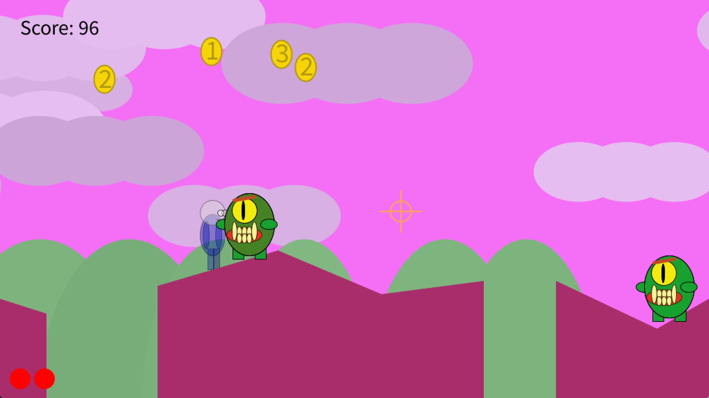

# Space Hopper

## Brief description of the game
2D side scroller where you explore alien worlds, jump over the gaps, shoot monsters and collect coins to finally raise a flag at the end of each level.
Inspired by Super Mario Bros and Contra which I have played on my Famicom clone ages ago!

## Gameplay demo

## Known bugs/problems
  All rather not game breaking.
  - Hero might get stuck in the terrain when there is a "step" in the terrain and the player stands between two blocks, clipping into one of them.
    Player can easily jump out of the block to get unstuck and continue playing.
    
  - Jumping might not work sometimes when the player is moving down the slope.
    Possible fix by implementing a method which would snap the player to the slope and move the player along it at an angle,
    applying both speedX and speedY and not only speedX.
    Currently player speed is just applied horizontally which causes the hero to be in the air when going down steep slopes.
    
  - Monsters can sometimes appear and disappear on the screen when they are just at the very edge of a gap in the terrain
    and the terrain scrolls along with the player making the monster to fall into the gap and then
    reappear on the terrain as X coordinate changes due to scrolling.
    Simple fix would be to remove monster if its Y is larger than screen height or prevent from spawning at the edge of TerrainBlock
    
  - Not handled error when the user inputs a non numerical value into the level length prompt.
  - The game has no end at the moment. Player can go on through an infinite number of levels

## Controls
- A - move left
- D - move right
- W - jump
- E - action key (raising the flag)
- Left Mouse Button - shoot
- P - debug mode (additional info displayed)

## References
1. Point on rectangle collision algorithm:\
[www.jeffreythompson.org](http://www.jeffreythompson.org/collision-detection/point-rect.php)
2. Rectangle on rectangle collision algorithm:\
[www.jeffreythompson.org](http://www.jeffreythompson.org/collision-detection/rect-rect.php)
3. Line segment intersection equations:\
[Wikipedia - Line intersection](https://en.wikipedia.org/wiki/Line%E2%80%93line_intersection)
4. Key handling based on the video:\
["Processing - respond to multiple key presses - YouTube"](https://www.youtube.com/watch?v=yKv02lq7JHs)
5. Idea for using line segment to detect collision with the terrain:\
[[Unity] Creating a 2D Platformer (E02. collision detection) - Sebastian League](https://www.youtube.com/watch?v=OBtaLCmJexk)